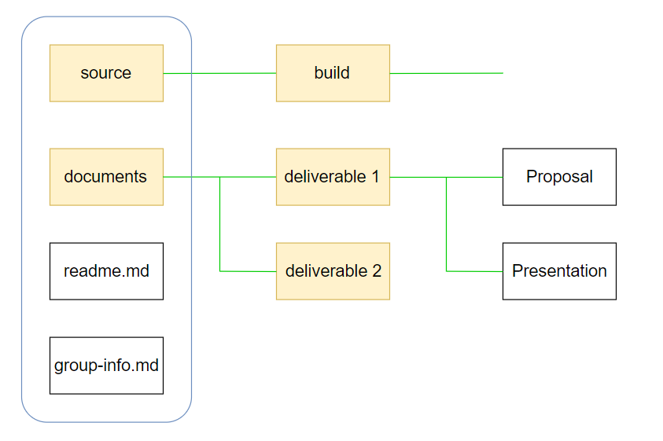

# Group Project: Pro TA
CSCE 4444 Software Engineering 
### Members
[Keenan Jabri](#) | [Naumaan Hassan](#) | [Nicolas Stencel](#) | [Manuel Vargas](#)

## Directory Structure
In our main directory there are two loose files: readme.me & group-info.md. Our readme is what you are currently reading from and contains general information about our project. We then have two folders: documents & source. Documents will house all of our deliverables as well as meeting minutes.along with any other extra files we may have.

## Important Dates
#### September
- [x] Assignment I - Create Repository 9/6
- [ ] Deliverable I - Project Proposal 9/13 (**7% of final grade**)
   - Project Plan
   - Risk Management
- [ ] Proposal Presentation 9/14
- [ ] Requirements Elicitation Workshop 9/21

#### October
- [ ] Deliverable II - Peer Review 10/12 (**13% of final grade**)

#### November
- [ ] Deliverable III - Implenting & Testing 11/3 (**20% of final grade**)
- [ ] Code Inspection 11/16
- [ ] Project Presentation & Demo 11/28 & 11/30

#### December
- [ ] Usability Testing 12/5