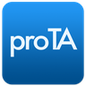
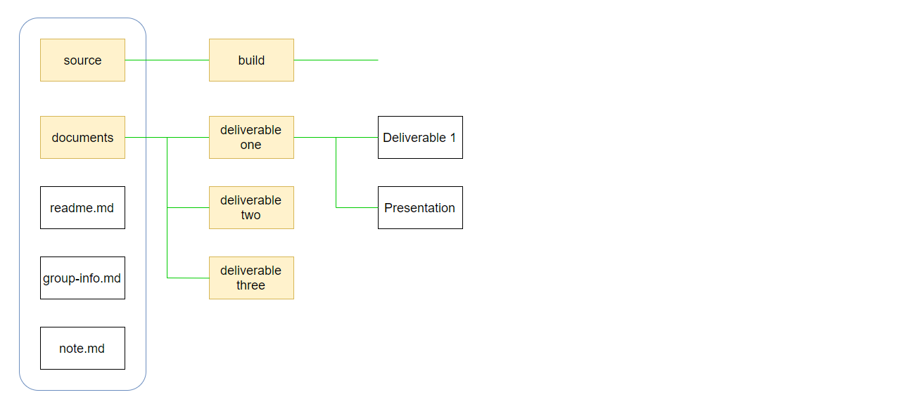

<!-- using shields.io for status buttons -->

University of North Texas, CSCE 4444 Software Engineering Group Project

### Members
[Keenan Jabri](#) | [Naumaan Hassan](#) | [Nicolas Stencel](#) | [Manuel Vargas](#)

## Directory Structure
In our main directory there are three text files and two folders. **`/documents`** houses our deliverables and **`/source`** will contain the solution.

## Important Dates
#### September
- [x] Assignment I - Create Repository 9/6
- [x] Deliverable I - Project Proposal 9/13 (**7% of final grade**)
   - Project Plan
   - Risk Management
- [x] Proposal Presentation 9/14
- [x] Requirements Elicitation Workshop 9/21

#### October
- [x] Deliverable II - 10/10 (**13% of final grade**)
- [x] Deliverable II - Peer Review 10/12

#### November
- [x] Code Inspection 11/13
- [x] Deliverable III - Implementing & Testing 11/27 (**20% of final grade**)
- [x] Project Presentation & Demo 11/28 & 11/30

#### December
- [x] Usability Testing 12/5